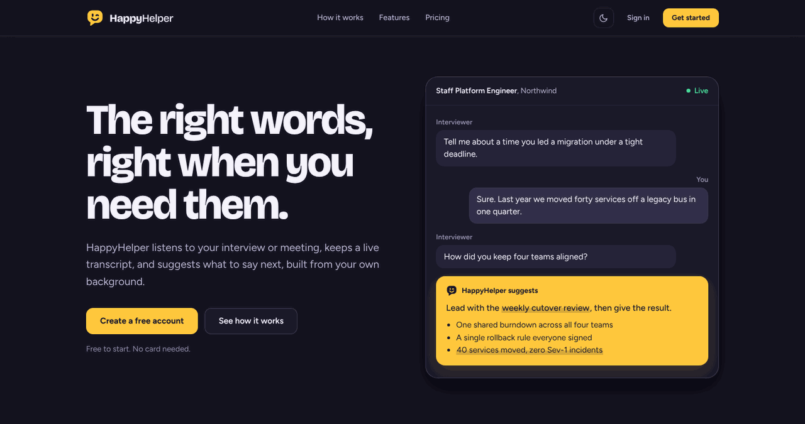
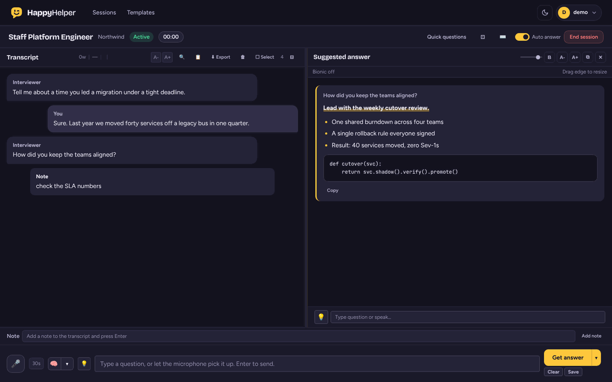
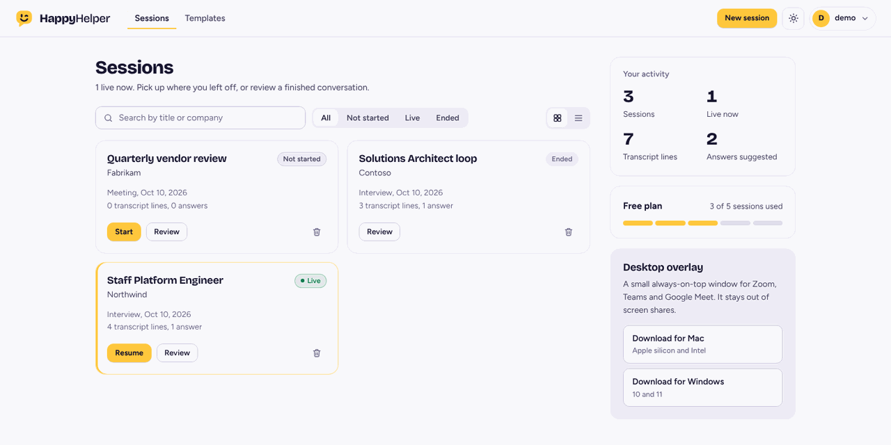

<p align="center">
  <picture>
    <source media="(prefers-color-scheme: dark)" srcset="docs/brand/logo-horizontal-dark.svg">
    
  </picture>
</p>

<p align="center"><strong>The right words, right when you need them.</strong></p>

HappyHelper is a live helper for interviews and meetings. It listens to the conversation, keeps a
transcript, and suggests what to say next, built from the background you give it.

It has two parts:

- **Web app** (Django): sessions, live transcript, suggested answers, templates, review and export.
- **Desktop overlay** (Electron): a small always-on-top window for Mac and Windows that shows
  answers beside your call.



## Contents

- [What it does](#what-it-does)
- [Quick start](#quick-start)
- [Configuration](#configuration)
- [Desktop overlay](#desktop-overlay)
- [Project layout](#project-layout)
- [Design system](#design-system)
- [Tests](#tests)
- [Deployment](#deployment)
- [Known gaps](#known-gaps)
- [Using it responsibly](#using-it-responsibly)

## What it does

| | |
|---|---|
| **Live transcription** | Microphone audio is transcribed through Groq Whisper, with a label for who is speaking. |
| **Suggested answers** | Press <kbd>Ctrl</kbd> <kbd>Enter</kbd> (or turn on Auto answer) and a suggestion appears beside the transcript. It draws on your background, the job description and the conversation so far. |
| **Answer templates** | Shape the answer: STAR, bullet points, step by step, a follow-up email, or a prompt of your own. |
| **Conversation plan** | Before the call, generate likely questions and talking points from the role and your background. |
| **Meeting mode** | Tracks several speakers and writes a summary with decisions and action items. |
| **Review and export** | Every session keeps its transcript and answers. Export to text or Markdown, or delete it. |
| **Plans** | Free, Pro and Team, with Stripe Checkout for upgrades. |



## Quick start

You need Python 3.11 or newer.

```bash
git clone https://github.com/sandhoter2/happyhelper.git
cd happyhelper

python -m venv .venv && source .venv/bin/activate
pip install -r requirements.txt

export GROQ_API_KEY=gsk_your_key        # transcription and answers
python manage.py migrate
python manage.py createsuperuser
python manage.py runserver
```

Open <http://localhost:8000>. Signed out, you see the landing page. Signed in, you see your sessions.

Without a `DATABASE_URL` or `MYSQL_HOST`, the app uses a local SQLite file, which is all you need
for development.

> The `.env` file in this repository is encrypted with git-crypt. If you do not have the key, leave
> it alone and set the variables in your shell as shown above. The app starts fine either way.

## Configuration

Everything is read from environment variables in `happyhelper/settings.py`.

| Variable | Needed for | Default |
|---|---|---|
| `GROQ_API_KEY` | Transcription and answers | none |
| `GROQ_MODEL` | Answer model | `openai/gpt-oss-120b` |
| `GROQ_WHISPER_MODEL` | Transcription model | `whisper-large-v3-turbo` |
| `OPENROUTER_API_KEY` | Optional. When set, answers come from OpenRouter instead of Groq | none |
| `OPENROUTER_MODEL` | OpenRouter model | `openai/gpt-4o-mini` |
| `DJANGO_SECRET_KEY` | Production | a development key |
| `DEBUG` | Set to `False` in production | `True` |
| `DATABASE_URL` | Postgres (or any `dj-database-url` target) | SQLite |
| `MYSQL_HOST`, `MYSQL_PORT`, `MYSQL_DB`, `MYSQL_USER`, `MYSQL_PASSWORD` | MySQL as the database, and the backup sync page | unset |
| `STRIPE_SECRET_KEY`, `STRIPE_PUBLIC_KEY`, `STRIPE_WEBHOOK_SECRET`, `STRIPE_PRICE_PRO`, `STRIPE_PRICE_TEAM` | Paid plans | unset |
| `EXT_TOKEN` | Shared token for the browser extension API | `pkai-local-dev` |

If the Stripe keys are missing, the upgrade buttons lead to a page that says billing is not
switched on. No payment is attempted.

## Desktop overlay

The overlay lives in `happyhelper-electron-overlay/`.

```bash
cd happyhelper-electron-overlay
npm install
npm start            # run it
npm run build:mac    # .dmg for Apple silicon and Intel
npm run build:win    # Windows installer and portable .exe
```

To connect it, sign in from the overlay, or open **Profile** in the web app, copy the
**Desktop overlay token**, and paste it into the overlay's settings.

<kbd>⌘</kbd> <kbd>⇧</kbd> <kbd>Space</kbd> (<kbd>Ctrl</kbd> <kbd>Shift</kbd> <kbd>Space</kbd> on Windows)
shows or hides the window. The overlay sets Electron's content protection flag, so it is left out
of screen shares and screenshots.

## Project layout

```
happyhelper/                    Django project (settings, root URLs, WSGI)
interview/                      The app
  models.py                     UserProfile, InterviewSession, TranscriptEntry, AIMessage, PromptTemplate, Task
  views.py                      Pages and the JSON API
  urls.py                       Routes
  templates/interview/
    _styles.html                Design tokens and shared components (start here to restyle)
    _head.html                  Fonts, favicon, theme bootstrap
    _logo.html                  The logo, as inline SVG
    _public_nav.html            Navigation for signed-out pages
    _public_footer.html         Footer for signed-out pages
    _theme_toggle.html          Light and dark switch
    base.html                   App shell for signed-in pages
    auth_base.html              Layout for sign in and sign up
    landing.html, pricing.html  Signed-out pages
    home.html                   Sessions dashboard
    new_session.html            Create a session
    live_session.html           The live workspace
    session_detail.html         Review a finished session
    templates_page.html         Answer templates
    profile.html, settings.html Account and server settings
happyhelper-electron-overlay/   Desktop overlay (Electron)
docs/brand/                     Logo files
docs/screenshots/               Images used in this README
```

### Main routes

| Route | Page |
|---|---|
| `/` | Landing page when signed out, sessions when signed in |
| `/pricing/` | Plans |
| `/login/`, `/signup/` | Sign in, create an account |
| `/session/new/` | Create a session |
| `/session/<id>/` | Live workspace |
| `/session/<id>/detail/` | Review |
| `/templates/` | Answer templates |
| `/profile/`, `/settings/` | Account, API keys and models |
| `/admin/` | Django admin, including the internal task board |

The JSON API sits under `/api/`. See `interview/urls.py` for the full list.

## Design system

The whole interface is styled from one file: `interview/templates/interview/_styles.html`. Every page
includes it. Change a token there and it changes everywhere, in both themes.



### Colour

| Token | Dark | Light | Used for |
|---|---|---|---|
| `--brand` | `#FFC83D` | `#FFC83D` | Primary buttons, the logo, highlights. The same in both themes |
| `--on-brand` | `#17152E` | `#17152E` | Text and icons on yellow |
| `--bg` | `#14131F` | `#F6F5FA` | Page background |
| `--bg2` | `#1B1A2A` | `#FFFFFF` | Cards and panels |
| `--bg3` | `#252338` | `#EEECF6` | Insets, hover states, chat bubbles |
| `--text` | `#F3F1FB` | `#17152E` | Body text |
| `--text2` | `#B9B5D3` | `#45415F` | Secondary text |
| `--text3` | `#928EB0` | `#69658A` | Captions and hints |
| `--accent` | `#FFC83D` | `#4636C9` | Links and focus rings |
| `--accent2` | `#A9A4FF` | `#A15C00` | Secondary accent |
| `--green` | `#4ADE9B` | `#0F7B4F` | Live, success |
| `--red` | `#FF7A7A` | `#C4283C` | Destructive actions, errors |
| `--yellow` | `#FFA552` | `#A65A00` | Warnings (orange, so it is never confused with the brand yellow) |

Text colours meet WCAG AA (4.5:1) on the surfaces they are used on. Ink on brand yellow is 11.5:1.

Colours with transparency are written as `rgb(var(--accent-rgb) / 0.2)`, so they follow the theme
too. Avoid hard-coded hex values in page templates.

### Type

| Role | Family | Token |
|---|---|---|
| Headings and the wordmark | Bricolage Grotesque | `--display` |
| Everything you read | Figtree | `--sans` |
| Code, tokens and timers | JetBrains Mono | `--mono` |

Labels are written in sentence case. Monospace is for code, not decoration.

### Logo

The mark is a speech bubble with a wink: a helper that quietly has your back.

| File | Use |
|---|---|
| `docs/brand/logo-horizontal-dark.svg` | On dark backgrounds |
| `docs/brand/logo-horizontal-light.svg` | On light backgrounds |
| `docs/brand/logo-mark.svg` | The mark alone, for small sizes |
| `docs/brand/app-icon.svg` | App icon (the overlay's `.png`, `.ico` and `.icns` are rendered from it) |

In templates, use the partial instead of an image:

```django


```

On a yellow surface, add `class="on-brand"` to the container and the mark inverts.

### Themes

Dark and light are both first class. The theme is resolved before first paint, in this order: the
choice saved in the browser, the account setting, then the operating system preference.

## Tests

```bash
python manage.py test interview
```

## Deployment

The `Dockerfile` runs `build.sh` and then Gunicorn. `build.sh` installs dependencies, collects static
files, checks the database connection, runs migrations, creates the superuser from
`DJANGO_SUPERUSER_USERNAME`, `DJANGO_SUPERUSER_EMAIL` and `DJANGO_SUPERUSER_PASSWORD`, and seeds the
default answer templates.

`render.yaml` describes the Render service. Pushes to `main` deploy automatically, so work on a
branch and merge when you are ready.

## Known gaps

These are in the code today. They are listed here so nobody is surprised.

- **Settings are server-wide and open to every signed-in user.** `/settings/` writes API keys and
  model names to the server's `.env`, and shows a preview of the current keys. On a shared
  deployment this should be limited to staff.
- **A shared API token with a public default.** `EXT_TOKEN` defaults to `pkai-local-dev`, and
  `render.yaml` sets the same value. Any request carrying it passes the API's token check. Set a
  private value in production, or remove the shared token and rely on per-user tokens.
- **The release workflow points at an old folder.** `.github/workflows/electron-release.yml` uses
  `parakeetai-electron-overlay/`. The folder is now `happyhelper-electron-overlay/`, so the workflow
  fails until that is updated. Its release notes also use the old product name.
- **`render.yaml` has an old start command** (`local_parakeet.wsgi`). The Dockerfile uses the
  correct `happyhelper.wsgi`.
- **The Free plan limit is five sessions in total**, not five per month as the pricing page says.
- **The pricing page describes features that are not built yet**: the 14-day trial, annual billing,
  per-plan models and seven-day history.
- **No licence file.** Add one before inviting outside contributors.

## Using it responsibly

HappyHelper records and transcribes conversations and sends audio and text to third-party model
providers (Groq, and OpenRouter if you configure it).

- Recording laws differ by place. Many require the consent of everyone on the call.
- Many employers do not allow outside help during interviews. Check the rules that apply to you.
- Do not put confidential material into a session unless you are allowed to share it with those
  providers.
